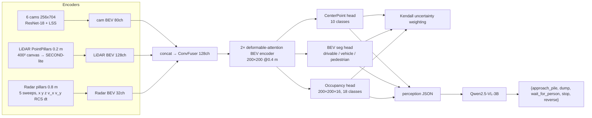

# offroad-bevfusion

[](https://github.com/pavanyadava007/offroad-bevfusion/actions) [](https://huggingface.co/spaces/pavanyadava07/offroad-bevfusion)

Camera + LiDAR + radar BEV multitask perception (3D detection · BEV segmentation · 3D occupancy) with a deformable-attention
BEV encoder and uncertainty-weighted multitask loss, TensorRT FP16/INT8 + ROS 2 Humble deployment, off-road (GOOSE) transfer,
adverse-weather evaluation, and a VLM task-grounding interface (Qwen2.5-VL-3B → wheel-loader action primitives).
Built on a zero-cost stack: Kaggle GPU (training), Colab T4 (TensorRT), DVC + Google Drive, W&B free tier, GitHub Actions, HF Spaces.



## Evidence map (JD requirement → deliverable → artefact)

| JD requirement | Deliverable | Evidence (produced by the pipeline) |
|---|---|---|
| 3D det / seg / occupancy | Multitask heads on one shared 200×200 BEV (`obf/models/heads`) | `docs/REPORT.md` §1: mAP / NDS / seg mIoU / occ mIoU |
| LiDAR–camera–radar fusion | Radar pillar branch + `ConvFuser` (`obf/models/encoders/pillars.py`, `fusion/bev_fuser.py`) | ablation cam / cam+L / cam+L+R; radar-dropout robustness |
| Transformer / BEV / multitask | `DeformBEVEncoder` (grid_sample MSDeformAttn, TRT-native), `UncertaintyWeighting` | `configs/ablation_no_deform.yaml`, `ablation_fixed_weights.yaml` rows |
| VLA | `obf/vla`: perception JSON → Qwen2.5-VL-3B → JSON action, fail-safe parser, optional LoRA | `results/vla_safety.json` (50-frame stop-recall eval) |
| TensorRT / ONNX / Jetson | ONNX opset 17 static; FP16 + INT8 entropy PTQ (Python builder API); C++ runner (`cpp/`) | `results/latency_l4.md` — **Orin not measured (no hardware)** |
| ROS / C++ / mmdetection | ROS 2 Humble C++ node → `Detection3DArray`, `OccupancyGrid`; CMake TRT lib; mmdet3d-compatible pillar encoders (`use_mmdet3d`) | `docs/rviz_replay.gif` (`scripts/make_rviz_gif.sh`) |
| Off-road / adverse weather | GOOSE BEV-seg transfer (`obf/data/goose.py`) — LiDAR-only (no calib in 2D/3D zips, camera branch zeroed); nuScenes rain/night/clear subsets (`obf/data/splits.py`) | `docs/REPORT.md` §3–4 domain-shift tables |
| Data leadership | `dvc.yaml` (14 stages), per-scene mAP hard-example mining + weighted resampling, auto-labelling, dataset card | this repo, `docs/DATASET_CARD.md` |
| Publications | arXiv:2110.00791, thesis (SparseDrive, ISO 21448) | CV; SOTIF mapping in `docs/VLA_SAFETY.md` |

## Status

| Component | State |
|---|---|
| Code: data pipeline, model, training, eval, export, TRT, C++, ROS 2, VLA, DVC, CI | complete — CI runs unit tests, ONNX opset-17 export with ORT parity (4.8e-7), the full train→eval→dump→VLA-eval loop on synthetic data (`dataset=fake`), and a C++ syntax check |
| nuScenes-mini training / ablation numbers | done on a local NVIDIA L4 (12 ep each): cam 0.022/0.059 → cam+L 0.047/0.099 → cam+L+R 0.053/0.108 (mAP/NDS), seg mIoU 0.302, occ mIoU 0.086; radar-dropout and mined-finetune rows in `docs/REPORT.md` (rain/night subsets are empty on mini_val → “—”) |
| TensorRT engines + latency table | built + measured on a local NVIDIA L4 (`results/latency_l4.md`; `scripts/colab_trt.sh` remains for T4 — relabel the output if used) |
| GOOSE transfer | done (goose_2d/3d_val.zip, 8 scenes 6/2 split): zero-shot drivable IoU 0.021 → fine-tuned 0.348; LiDAR-only — the 2D/3D zips ship no calibration, `goose_calib.py` writes identity and the camera branch self-disables |
| rviz2 GIF | done — `docs/rviz_replay.gif` recorded in the `ros:humble` container (Xvfb + ffmpeg; obf_node at 11.5 ms/frame on the L4 FP16 engine) |

## Quick start
```bash
pip install -e .[dev]                          # CPU dev / tests
pytest -q && python -m obf.export.onnx_export --cfg configs/tiny.yaml --out /tmp/tiny.onnx
python -m obf.train --cfg configs/tiny.yaml --opts dataset=fake train.epochs=1   # CPU smoke of the whole loop, no data needed
bash scripts/download_data.sh                  # nuScenes-mini + map expansion, Occ3D-nuScenes, GOOSE
dvc repro infos splits                         # infos (radar 5-sweep accumulation, map raster, Occ3D links)
python -m obf.train --cfg configs/base.yaml    # Kaggle: bash scripts/kaggle_train.sh (fits 30 GPU-h/week)
python -m obf.eval  --cfg configs/base.yaml --ckpt checkpoints/cam_lidar_radar/best.pt --name cam_lidar_radar [--subset rain] [--radar_drop 1.0]
python -m obf.export.onnx_export --cfg configs/base.yaml --ckpt ... --out results/export/bevfusion.onnx
bash scripts/colab_trt.sh                      # FP16 / INT8 engines + latency + INT8 accuracy check (Colab T4)
python -m obf.vla.safety_eval --cfg configs/base.yaml --ckpt ... --perception model   # 50-frame safety eval
python -m obf.report                           # -> docs/REPORT.md
```
ROS 2: `cd ros2_ws && colcon build --cmake-args -DTENSORRT_ROOT=... && ros2 launch obf_ros replay.launch.py`.
C++ runner: `cmake -S cpp -B build -DTENSORRT_ROOT=... && cmake --build build && ./build/obf_runner <engine> data/samples/replay/0000_* 200`.

## Design notes
* One 0.4 m grid ([-40, 40] m², z ∈ [-1, 5.4]) for all heads — identical to the Occ3D-nuScenes voxel grid, so occupancy needs no resampling;
  detection range is therefore 40 m instead of the usual 51.2 m (stated when comparing to leaderboard numbers).
* All calibration math (LSS frustum → BEV index) and voxelisation run in the data pipeline; the network graph is pure tensor ops with
  static shapes → ONNX opset 17 → TensorRT with no custom plugins (grid_sample is native; scatter-add lowers to TRT's bundled
  ScatterReduction plugin, registered by the standard `init_libnvinfer_plugins` call — nothing to compile or ship).
* Radar: 5 accumulated sweeps per radar (25 total), ego-motion compensated, features (x, y, z, v_x, v_y comp., RCS, Δt); train-time
  radar dropout p = 0.2 for robustness; test-time dropout 50 % / 100 % reported.
* Multitask: Kendall homoscedastic uncertainty weighting (learned log σ² per task); fixed-weight ablation included.
* VLA safety: deterministic rule (pedestrian in path < 5 m → `stop`) is both the prompt's hard rule and the evaluation oracle;
  unparsable VLM output → `stop` (fail-safe). ISO 21448 mapping: `docs/VLA_SAFETY.md`.
* Licences: code MIT; nuScenes CC BY-NC-SA 4.0 (non-commercial — portfolio use only); GOOSE CC BY-SA 4.0; Occ3D MIT.
